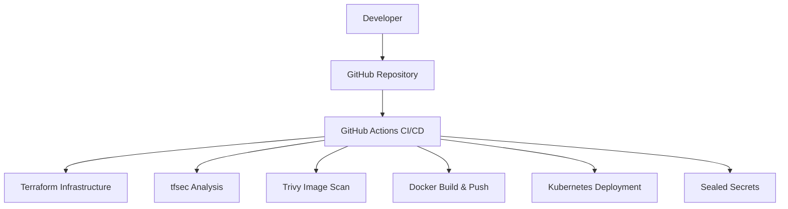

# 🚀 DevSecOps Pipeline using GitHub Actions, Terraform, tfsec, Trivy, Sealed Secrets, and Kind Kubernetes


## File Structure 

```
.
├── .github/
│   └── workflows/
│       └── cicd.yml        # Defines the CI/CD pipeline automation using GitHub Actions.
├── terraform/
│   └── main.tf             # Infrastructure as Code (IaC) for cloud resources (e.g., S3 buckets).
├── app/
│   ├── Dockerfile          # Instructions to build the container image for the Python application.
│   └── main.py             # The simple Python Flask application code.
└── k8s/
    ├── deployment.yaml     # Kubernetes manifest to deploy the application.
    └── sealed-secret.yaml  # The encrypted, version-controlled Kubernetes secret.
```

## 📑 Table of Contents

1. [Project Overview](#project-overview)
2. [Architecture](#architecture)
3. [Core Technologies & Tools](#core-technologies--tools)
4. [The DevSecOps Workflow in Action](#the-devsecops-workflow-in-action)
5. [Project Setup and Installation](#project-setup-and-installation)
6. [Code and Configuration Details](#code-and-configuration-details)
7. [How to Run the Application Locally](#how-to-run-the-application-locally)

---

## 🎯 Project Overview

This project demonstrates a complete **DevSecOps pipeline** using:

- **GitHub Actions** for CI/CD
- **Terraform** to provision infrastructure
- **tfsec** for Terraform static code analysis
- **Trivy** to scan Docker images
- **Kubernetes Sealed Secrets** for secure secret management
- **Kind** for local Kubernetes cluster setup

The goal is to ensure security, automation, and reliability throughout the software delivery lifecycle.

---

## 🏗️ Architecture



---

## 🧰 Core Technologies & Tools

- [GitHub Actions](https://github.com/features/actions)
- [Terraform](https://www.terraform.io/)
- [tfsec](https://aquasecurity.github.io/tfsec/)
- [Trivy](https://aquasecurity.github.io/trivy/)
- [Kind (Kubernetes in Docker)](https://kind.sigs.k8s.io/)
- [Kubernetes Sealed Secrets](https://github.com/bitnami-labs/sealed-secrets)

---

## 🔁 The DevSecOps Workflow in Action

### 🔧 GitHub Actions Pipeline

1. **Code Push to GitHub**
2. **Run Terraform to create resources**
3. **tfsec** scans Terraform for security misconfigurations
4. **Trivy** scans the Docker image for vulnerabilities
5. **Docker Image Built and Pushed**
6. **Secrets Encrypted via Sealed Secrets**
7. **Kubernetes Deployment using kubectl**

### ✅ Security Gates

- `tfsec` blocks insecure Terraform (e.g., public S3 buckets)
- `Trivy` blocks if Docker image has HIGH/CRITICAL vulnerabilities
- `kubeseal` ensures no plaintext secrets ever reach GitHub

---

## ⚙️ Project Setup and Installation

### Prerequisites

Make sure the following are installed:

- [Git](https://git-scm.com/)
- [Docker Desktop](https://www.docker.com/products/docker-desktop)
- [kubectl](https://kubernetes.io/docs/tasks/tools/)
- [kind](https://kind.sigs.k8s.io/)
- [kubeseal CLI](https://github.com/bitnami-labs/sealed-secrets)

### Clone the Repo

```bash
git clone https://github.com/amit-kr-yash/task-2.git
cd task-2
```

### Create Kind Cluster

```bash
kind create cluster
```

### Install Sealed Secrets Controller

```bash
kubectl apply -f https://github.com/bitnami-labs/sealed-secrets/releases/download/v0.26.1/controller.yaml
kubectl get pods -n kube-system -l name=sealed-secrets-controller
```

---

## 🧪 Code and Configuration Details

### ✅ Secure S3 Bucket (Terraform)

```hcl
resource "aws_s3_bucket" "secure_bucket" {
  bucket = "my-secure-devsecops-bucket-12345"

  versioning {
    enabled = true
  }

  server_side_encryption_configuration {
    rule {
      apply_server_side_encryption_by_default {
        sse_algorithm = "AES256"
      }
    }
  }

  logging {
    target_bucket = aws_s3_bucket.log_bucket.id
    target_prefix = "log/"
  }
}

resource "aws_s3_bucket" "log_bucket" {
  bucket = "my-secure-devsecops-log-bucket-12345"
}

resource "aws_s3_bucket_public_access_block" "secure_bucket_pab" {
  bucket = aws_s3_bucket.secure_bucket.id

  block_public_acls       = true
  block_public_policy     = true
  ignore_public_acls      = true
  restrict_public_buckets = true
}
```

### ⚠️ Example of Insecure Bucket (for tfsec test)

```hcl
resource "aws_s3_bucket" "insecure_bucket" {
  bucket = "my-insecure-devsecops-bucket-12345"
  acl    = "public-read"
}
```

---

## 🧪 How to Run the Application Locally

### Trigger the GitHub Actions Workflow

Push to GitHub to automatically trigger CI/CD:

```bash
git add .
git commit -m "Trigger CI/CD"
git push origin main
```

### Expected Results

- Terraform plans & applies securely.
- tfsec flags any insecure resources.
- Trivy scans image and blocks if critical vulnerabilities.
- Secrets are managed with Sealed Secrets.
- App is deployed to Kind cluster via GitHub Actions.

---

## 🔐 Security Scans Output (Sample)

### ✅ tfsec Passed Output

```bash
✔ No problems detected!
```

### ❌ tfsec Failed (for insecure S3 bucket)

```bash
✖ 1 potential problem(s) detected:
  - aws-s3-enable-bucket-encryption:
    Insecure bucket 'my-insecure-devsecops-bucket-12345' lacks encryption
```

### ✅ Trivy Passed Output

```bash
✔ No vulnerabilities detected
```

---

## 🙌 Conclusion

This project implements end-to-end **DevSecOps** principles using open-source tools.  
Security is embedded into CI/CD, ensuring fast yet secure deployments.
**Let's check for final commit**

--- 
